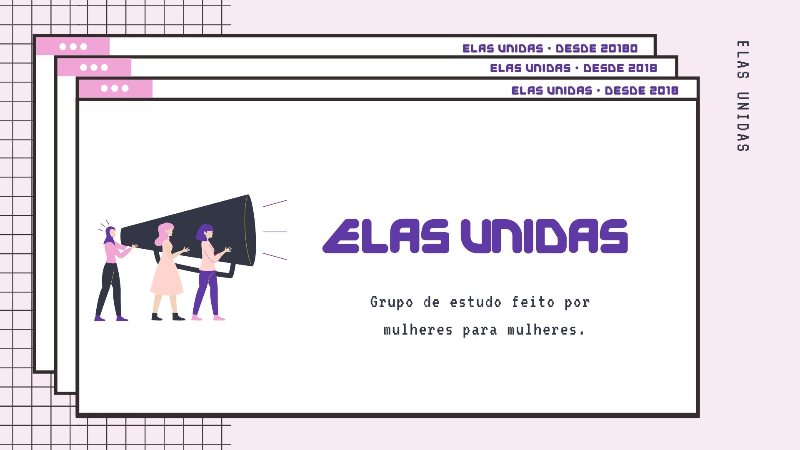

# ElasUnidas: javascript 

  

## :love_you_gesture: Sobre

Repositório de estudo em Javascript  
Nessa primeira parte vamos estudar com base no livro <strong>Eloquente Javascript - Parte 1: Linguagem</strong> 
Esse é o nosso projeto de estudo remoto piloto.

#### :dancers: Participantes:
<table>
  <tr>
	  <td align="center"><a href="https://www.linkedin.com/in/rayanepimentel/"><b>Rayane Pimentel</a></td> 	
  </tr>
</table>

<h3>Lets <strong>Go!!!</strong></h3>

## Pré-requisitos:
- Editor de código (vs code, atom...)
- Tentar participar dos encontros online aos sábados
- Realizar a leitura e o exercício da semana

## :heavy_check_mark: Features - Parte 1: Linguagem

- [x] Semana #01 
- [x] Semana #02
- [x] Semana #03
- [ ] Semana #04

## :books: Material que iremos utilizar:

- URI - https://www.beecrowd.com.br/judge/pt/

- Livro - https://github.com/braziljs/eloquente-javascript
## :woman_technologist: Semana #01

### :desktop_computer: Resumo do encontro:

<h3>Encontro 08/01/2022</h3>

- Dididimos como será o nosso grupo de estudo
- Teremos um livro base, onde estudaremos os capítulos durante a semana e no sábado vamos discutir sobre.
- E também vamos trazer alguns exercícios do URI.

<h3>Estudo da semana</h3>

Estudar os 3 primeiros capítulos do livro:
1. Valores, Tipos e Operadores  
2. Estrutura do Programa
3. ~~Funções~~ 

E trazer dúvidas para o próximo encontro: <strong>15/01/2022</strong>

Também podemos tirar dúvidas durante a semana pelo grupos de whatsapp ou telegram.

## :woman_technologist: Semana #02

### :desktop_computer: Resumo do encontro:

<h3>Encontro 15/01/2022</h3>

- Fizemos o exercicio FizzBuzz
- E não conseguimos seguir com o capitulo 3. Por isso pro próximo encontro estudaremos somente o cap 03 (funções)

<h3>Estudo da semana</h3>

Estudar o capítulo 3. do livro:

3. Funções

Trazer as dúvidas para o próximo encontro <strong>22/01/2022</strong>

<h3>Material de apoio:</h3>

1. [Reprograma](https://github.com/reprograma/On13-TodasEmTech-JavascritI#loops):

- Funções 
- Estrutura de dados, pra quê?
- Iteração/Repetição/Loops

2. [Reprograma](https://github.com/reprograma/On13-TodasEmTech-LogicaComJS)
- Tudo

<h3> Exercício extra </h3>

1. [URI - Iniciante](https://www.beecrowd.com.br/judge/pt/problems/index/1)
- 1001, 1002, 1003, 1004, 1005

## :woman_technologist: Semana #03

### :desktop_computer: Resumo do encontro:

<h3>Encontro 15/01/2022</h3>

- Fizemos o exercicio Recursion
- E como sugestão para o nosso 4. encontro, teremos um resumão dos 3 capitulos mais os exercicios. 

<h3>Estudo da semana</h3>

Resumo dos 3. capitulos

1. Valores, Tipos e Operadores
2. Estrutura do Programa
3. Funções

Mais os exercícios, em especial o dia capitulo 3. Funções: <strong>Contando feijões</strong>

Trazer as dúvidas para o próximo encontro <strong>29/01/2022</strong>

<h3>Material de apoio:</h3>

- Tudo o que já vimos

<h3> Exercício extra </h3>

1. [URI - Iniciante](https://www.beecrowd.com.br/judge/pt/problems/index/1)
- 1019, 1020

