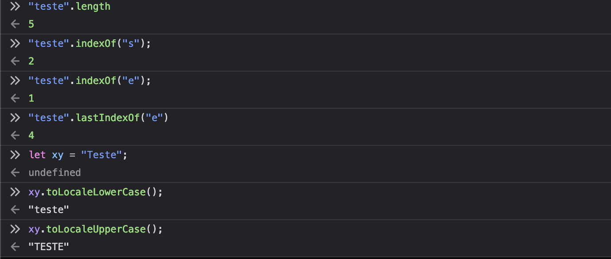
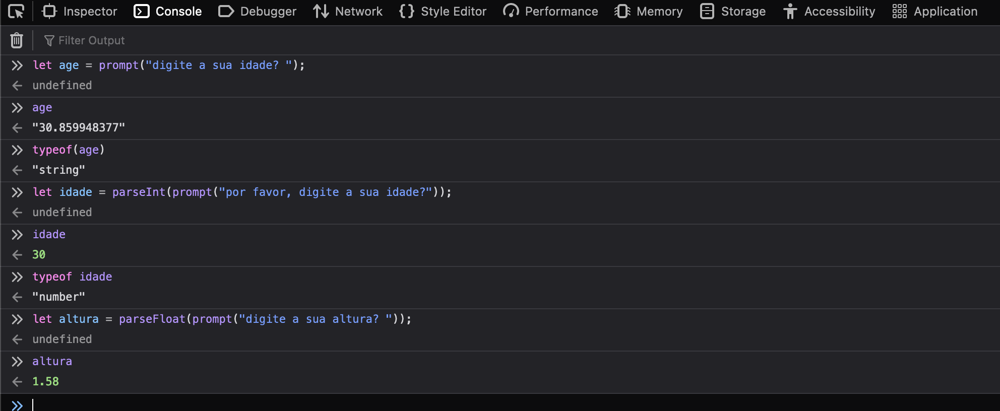
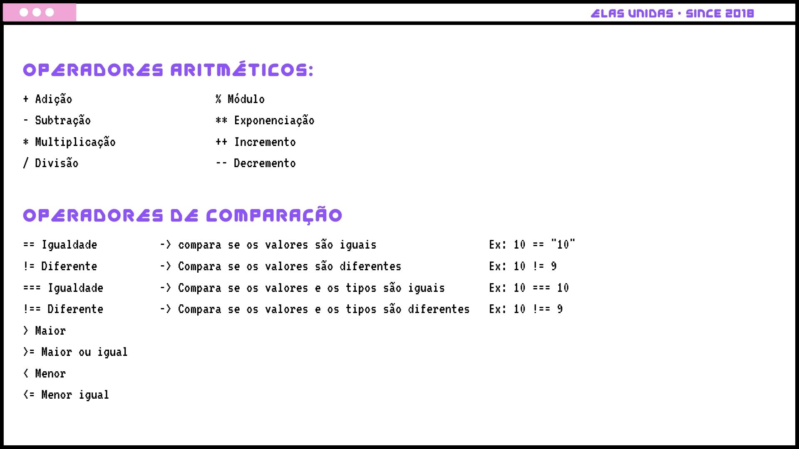

# Resumo

Resumo dos 3. capitulos

1. Valores, Tipos e Operadores
2. Estrutura do Programa
3. Funções

Mais os exercícios, em especial o dia capitulo 3<br>
Funções: **Contando feijões**.

## Variáveis, tipos de dados e operadores

### Variáveis 

**O que são variáveis**
<p>Quando atribuirmos um valor estamos salvando dados que podem ser acessado posteriormente. <br>Variáveis podem ter qualquer nome que inclua letras, números, $ e _, desde que não comecem com números;</p>

**Let ou Const**
<p>

Quando utilizar let ou const?<br><br>

**let** é quando podemos alterar o valor da variável. Exemplo:<br>
Temos a variável **estadoMorada**, que hoje atribuimos o valor de "São Paulo"
```javascript
let estadoMorada = "São Paulo";
```
e digamos que passou uns meses e a pessoa muda de estado e hoje ela mora no Ceará, então seu estadoMorada não é mais "São Paulo"
```javascript
estadoMorada = "Ceará";
```
Ou seja, antes **estadoMorada** era "São Paulo"e hoje é "Ceará"<br>
Com a variável **let** é possível realizar essa mudança de valores. <br>
<br>

**const** é quando o valor não pode ser mudado. Exemplo: Temos a variável **estadoNascimento**, atribuída ao valor "Pará", hoje será Pará e daqui uns meses/anos também, porque não podemos mudar o local de nascimento da pessoa.
```javascript
const estadoNascimento = "Pará";
```
Ou seja, const é imutável. O valor que atribuímos a ela, sempre será o mesmo.

| | |
| -- | -- |
| let | let endereco = 'Rua dos Bobos, nº 0'; |
| const | const PI = 3.14 |
</p>


### O que são tipos de dados?

Tudo o que escrevemos em javascript é um tipo de dado: ex: 13, 'olá', True;<br>

### string
É uma sequência de zero ou mais caracteres escritos entre aspas.<br> 
```js
let mensagem = "Olá mundo!";
```
Pode ser entre aspas simples 'exe' ou duplas "exe".
- Para sabermos o tamanho de uma string, utilizamos a propriedade length;
- O indexOf(), retorna o primeiro índice em que o elemento pode ser encontrado.
```js
let cat = "Frajola"
cat.indexOf("a") //vai nos retornar onde esta o primeiro a
//2
```
O retorno nesse exemplo será 2<br> Em Javascrit o primeiro indice será 0, o segundo 1, o terceiro 2 ...<br>
O indexOf também diferencia maiúsculas de minúsculas. 

```js
let cat = "FrAjola"
cat.indexOf("a") //vai nos retornar onde esta o primeiro a
//6
```

 


### Number
É uma variável tipada com número, sem "aspas". <br>

```javascript
let num = 13;
typeof(num); // verifica o tipo de dado.
//number
```

O **number** pode ser inteiro(int) e/ flutuante(float) 
```javascript
let numInteiro = 13;
let numFlutiante = 10.123456;
```

Podemos transformar um **número float em Int.**<br>
Exemplo:<br>
Eu quero que o usuário me passe um número e que sempre ele me retorne int. Mesmo ele colocando float.<br>
Para isso acontece utilizamos o **parseInt()**
```javascript
let myNumber = parseInt("Olá, me passe um número qualquer"); //(ex de um numero informado pelo usuário: 100.254868)
console.log(myNumber); // 100
```
Ou seja, ao utilizarmos parseInt() estamos dizendo que qualquer número após a casa decimal, não será considerado, será descartado<br>
E para sempre recebermos sempre um float, utilizamos o **parseFloat()**<br>

#### Quando usar float ou int ?<br>
Ex: Temos um programa que pergunta a idade da pessoa<br>

```js
let age = "Informe a sua idade, por favor?"; //18
console.log(age) // "18"
```
Se não colocarmos o parseInt ou float, será retornado uma string.<br>
Como precisamos que age seja number, precismos passar uns dos dois(int/float), nesse caso queremos a idade fechada, sem os meses.<br>
Ou seja, será **int**.
```js
let age = parseInt("Informe a sua idade, por favor?"); //18.6
console.log(age) // 18
```

Agora digamos que estamos em uma loja e precisamos saber o valor de um produto.<br>

```js
let price = "Olá, quanto custa esse chocolate? "; // 4.50
```
Como o preço pode ter decimais, nesse caso usariamos o float.
```js
let price = parseFloat("Olá, quanto custa esse chocolate? "); //4.50
console.log(price) //4.50
```

Mais exemplos:



Nesses exemplos da imagem, eu utilizei o comando prompt do javascript.<br>
Basicamente exibe uma caixa de diálogo(como se fosse um alert) com uma mensagem opcional solicitando ao usuário a entrada de algum texto.

### Booleans
(Comparação) Retorna se o valor é true(verdadeiro) ou false(falso). <br>
Ex: 
```js
10 > 9 // true  
13 == 10 // false
```
### Operadores



### Operadores lógicos

O javascript suporta 3 operadores lógicos, que são aplicadas ao valores booleanos. <br>
São: &&  || ! ou AND, OR ou NOT (e, ou, não)<br>

- Operado **&&** o valor é true, se ambos os dados passado para ele foram true;

Ex: Temos um concurso para participar de curso. E para isso é preciso ter 18 anos ou mais e(&&) morar em SP<br>

```js
se idade >= 18 && cidade == "São Paulo"
  retorna "Maravilha, você pode participar";
Senão
  retorna "Infelizmente você não tem todos os critérios :(";
```
Digamos que Ana, tem 20 anos e mora em São Paulo, nesse caso o retorno será: Maravilha, você pode participar.<br>
Já que Ana possui os dois critérios.


- Operado **OR** o valor é true, se uns dos dados fornecido for true;

Utilizando o mesmo exemplo, para participar do curso precisa ter 18 anos ou mais ou(||) morar em São Paulo.<br>

```js
se idade >= 18 || cidade == "São Paulo"
  retorna "Maravilha, você pode participar";
Senão
  retorna "Infelizmente você não tem todos os critérios :(";
```

Nossa outra candidata, Teresa tem 35 anos e mora em São Luiz do Maranhão.<br>
Nesse caso o retorno será true, já que ela tem uns dos critérios (+18 anos).

- Operador **!** inverte o valor dado a ele - !true retorna false e !false retorna true.<br><br>

```js
let tempo = "calor"
let tempoAgora = "calor";
let comparando = tempo == tempoAgora;
console.log(comparando); // true
console.log(!comparando); // false
```

## Condicionais

Usamos para verificar uma condição e definir se algo deve ou não acontecer a partir da condição dada.
### if / else

Definição Developer Mozila:<br>
"A condicional if é uma estrutura condicional que executa a afirmação, dentro do bloco, se determinada condição for verdadeira. Se for falsa, executa as afirmações dentro de else."<br>
<br>
Exemplo:<br>
Tá frio? Se sim, preciso de casaco. Senão, preciso de roupas leves.<br>
<br>
Com if..else

```js
let tempoFrio = true;

if(tempoFrio == true) {
 return "Preciso de casaco";
}else{
 return "Preciso de roupas leves";
}
// o retorno será "Preciso de casaco", mas se o tempoFrio for false, o retorno será "preciso de roupas leves"
```

Agora vamos fazer o exemplo do curso que utilizmos lá em "operadores lógicos"<br>
Temos outra canditada, a Helena que tem 30 anos e mora em Salvador.<br>
Lembrando que para participar do curso precisa ter >= 18 ou morar em São Paulo.<br>

```js
if(idade >= 18 || cidade == "São Paulo"){
  return "Maravilha, você pode participar";
}else{
  return "Infelizmente você não tem todos os critérios :(";
}
//"Maravilha, você pode participar"
```

### if / else if / else

É quando temos mais de duas condições<br>

```js
let horario = "manhã"

for(horario == "manhã") {
  return "Bom dia"
}else if(horario == "tarde") {
  return "Boa tarde"
}else{
  return "Boa noite"
}
```